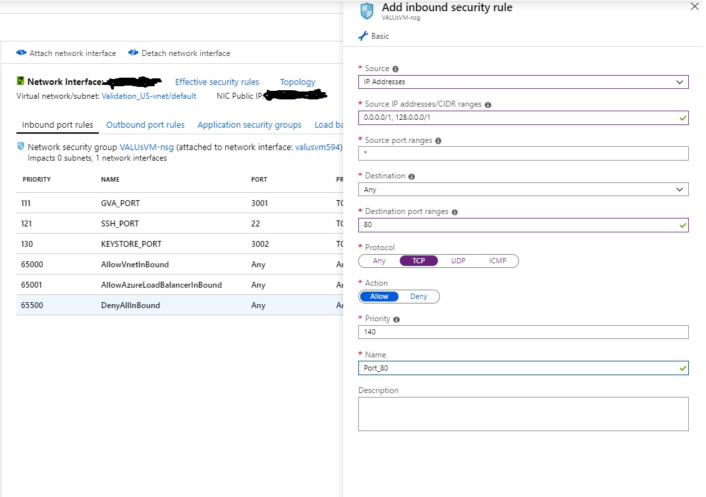

# How to update GVA and VP ports

After you use the deployment scripts, GVA is typically setup for port 3001 and VP is setup to port 3000.. If you require to change this to other ports, like port 80, this guide will show how to do it.. Following are the steps:

## Updating the GVA PORT to port 80
Login to the GVA VM:
> $ ssh \<_VM-URL_>

Install nginx:
> $ sudo apt install nginx -y

Configure nginx to listen on port 80, and forward the incoming requests to the GVA port 3001:
> $ sudo vim /etc/nginx/nginx.conf

Add the following server section to the http block:
>        # Forward Port 80 to GVA port 3001
>        server {
>             listen _80_;
>             server_name <iclpgva-xxx.yyy.cloudapp.azure.com>;
>             location / {
>                proxy_pass                          http://127.0.0.1:3001/;
>                proxy_set_header Host               $host;
>                proxy_set_header X-Real-IP          $remote_addr;
>                proxy_set_header X-Forwarded-For    $proxy_add_x_forwarded_for;
>             }
>        }

Restart Nginx so that the new configuration takes affect:
>$ systemctl restart nginx

In portal.azure.com, find the VM and open port 80:

This complets the GVA VM changes, now you should be able to use postman to access GVA REST API via PORT 80, you can also remove the PORT 3001, from the azure portal.

## Update the VP to point to the new GVA port 80:
Login to the VP VM:
>$ sudo <_VM-URL_>

Update the GVA URL environment variable:
>$ vim ~/.profile

In the .prfile file, find the line:
>export GVAurl='http://\<GVA-URL>:3001'

Replace it with with: 
>export GVAurl='http://\<GVA-URL>:80'

Save the file and exit the editor

Export the new environment variables
>$ source ~/.profile

Restart the VP docker container to take the new environment file in to affect:
>$ docker restart \<vp container ID>

# 
## Update the VP PORT to port 80
Login to the VP VM:
> $ ssh \<_VM-URL_>

Install nginx:
> $ sudo apt install nginx -y

Configure nginx to listen on port 80, and forward the incoming requests to the VP port 3000:
> $ sudo vim /etc/nginx/nginx.conf

Add the following server section to the http block:
>        # Forward Port 80 to VP port 3000
>        server {
>             listen _80_;
>             server_name <iclpgva-xxx.yyy.cloudapp.azure.com>;
>             location / {
>                proxy_pass                          http://127.0.0.1:3000/;
>                proxy_set_header Host               $host;
>                proxy_set_header X-Real-IP          $remote_addr;
>                proxy_set_header X-Forwarded-For    $proxy_add_x_forwarded_for;
>             }
>        }

Restart Nginx so that the new configuration takes affect:
>$ systemctl restart nginx

In portal.azure.com, find the VM and open port 80:

This complets the VP VM changes, now you should be able to access the VP webpage via the browser on port 80